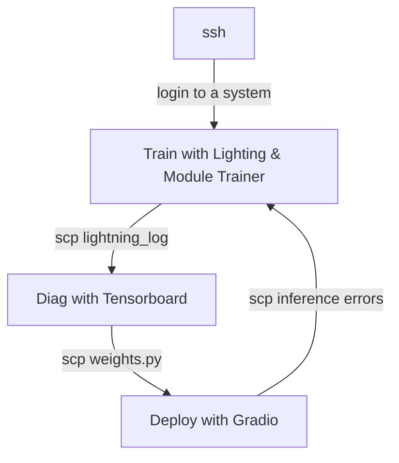
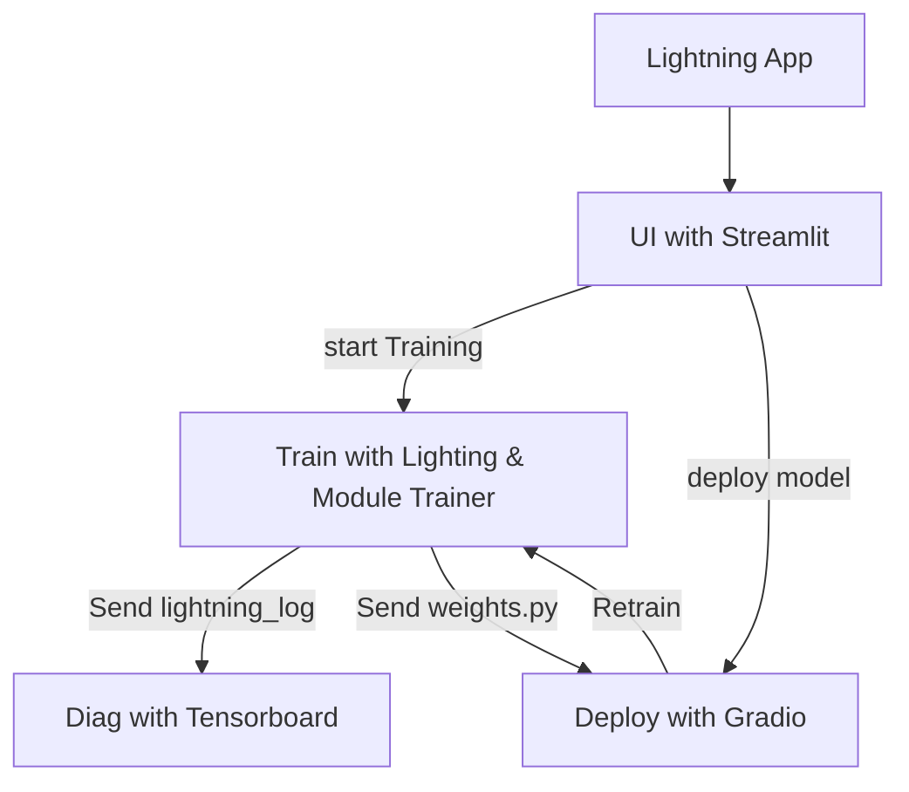

Lift-and-shift existing training and inference scripts as Lightning App.
Lightning App is the one tool that can automate the research workflow and ML pipeline.
Complexity integrating many components can be simplified with Lighting App.

## Current State  
Lets assume we have existing scripts for training and inference.
Orchestration is typical linear workflow.
Many tools and manual typing results in complex and error prone process.



## Target State with Lightning App
Same existing scripts are wrapped in as a Lightning App.
Lighting Flow is used to codify orchestration in Python code.
Lighting Work is used to run the script in the cloud. 
Interactive workflow is enabled with Lightning App.


## Data sharing across VMs are managed by Lightning App Drive

```mermaid
graph TD;
  T[Train]     <-- push, get --> LD[Lightning App Drive]
  I[Inference] <-- push, get --> LD
  D[Diag]]     <-- push, get --> LD
```

## Screenshots


## Explain the code