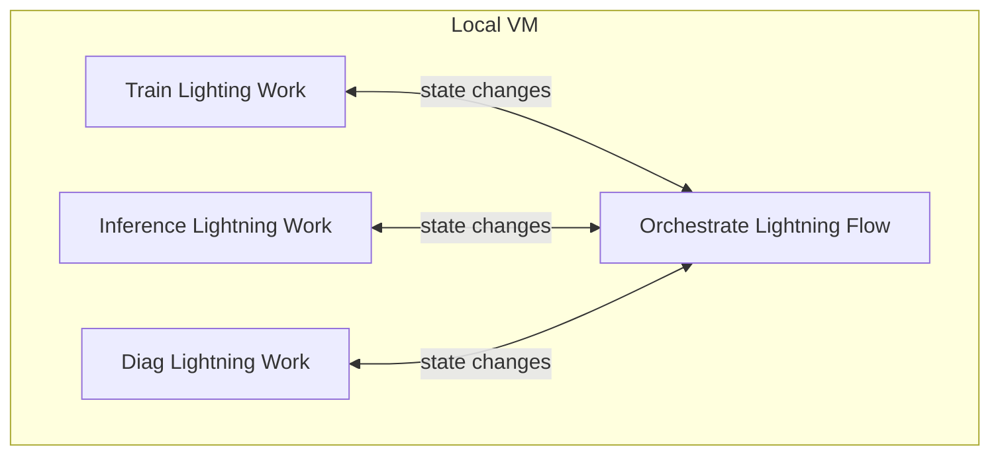
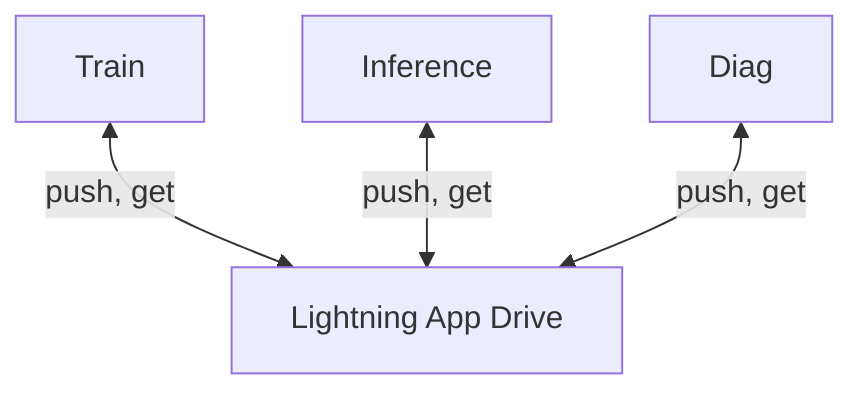
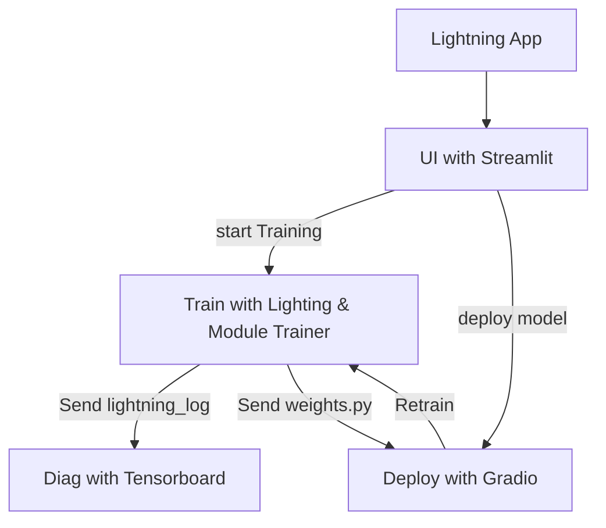

Lift-and-shift existing training and inference scripts as Lightning App.
Lightning App is the one tool that can automate the research workflow and ML pipeline.
Integrating many components each with it's own scripting tools take time and error pone.
Lighting App is pure Python. 
One language for all tasks.


## Test Locally and Scale in the Cloud

Develop locally on a single box and deploy on distributed on the cloud without any code change
  
- Develop and test locally
```bash
lightning app run app.py
```
- Deploy on the cloud

```bash
lightning app run app.py --cloud
```

## Lighting App is Composed of Lightning Flow(s) and Lightning Work(s)

Distributed state changes are serialized and managed by Lightning Flow.  
Lightning Flow then uses `run` to execute tasks.

Locally, Flow(s) and Work(s) run on a same VM.
The diagram below shows state changes.
The runs are omitted from this diagram.


On the cloud, there is one Lightning Flow VM and many Lightning Work VMs.  
The diagram below shows run and state changes.

```mermaid
graph TD;
  subgraph Flow VM -- always one VM
    LF[Orchestrate Lightning Flow]
  end
  subgraph Train VMs
    T[Train Lighting Work]      <-- state changes --> LF
    LF --run --> T
  end
  subgraph Inference VMs
    I[Inference Lightning Work] <-- state changes --> LF
    LF --run --> I
  end
  subgraph Diag VM  
    D[Diag Lightning Work]      <-- state changes-->  LF
    LF --run--> D
  end
```

## Data sharing across VMs are managed by Lightning App Drive

Lightning App Drive is available among Lightning Works.
Train, Inference, Diag can share files.



## Interactive workflow with Lightning App
Existing scripts, **unchanged**, are wrapped in as a Lightning App.
Lighting Flow is used to codify orchestration in Python code.
Lighting Work is used to run the script. 
Interactive workflow is enabled with Lightning App.



## Screenshots of Lighting App

- Enter Training Parameter

- Enter Model to Deploy

- Evaluate Training

- Inference on a Model

