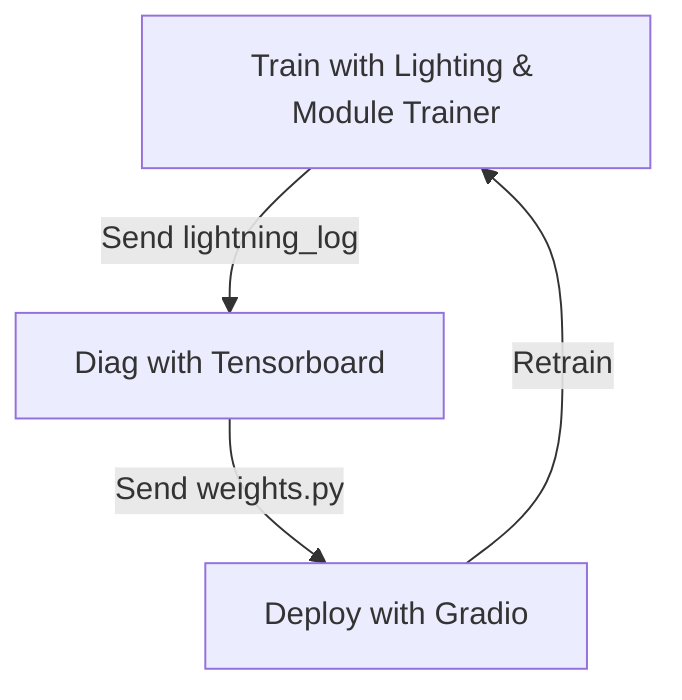
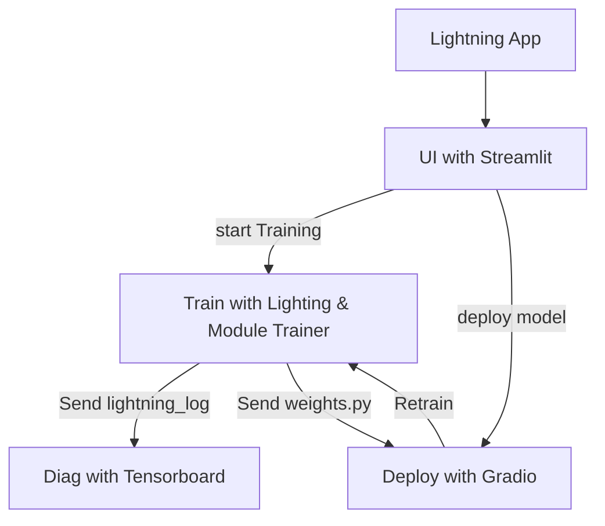

A lift-and-shift tutorial of Lightning App, Flow, Work.  
- interactive UI
- training
- training diag
- eval

Integrations:
- Streamlit
- Gradio
- Tensorboard

Lightning App:
- Drive


<table>
<tr>
<th align="center">

<p> 
<small>
Current Simple Workflow
</small>
</p>
</th>
<th align="center">

<p> 
<small>
Flexible Workflow with Lightning App
</small>
</p>
</th>
</tr>
<tr>
<td>
<!-- REMOVE THE BACKSLASHES -->

</td>
<td>
<!-- REMOVE THE BACKSLASHES -->

</td>
</tr>


```
train_script.py --trainer.max_epochs=1 --trainer.limit_train_batches=12 --trainer.limit_val_batches=4 --trainer.callbacks=ModelCheckpoint --trainer.callbacks.monitor=val_acc
``` 